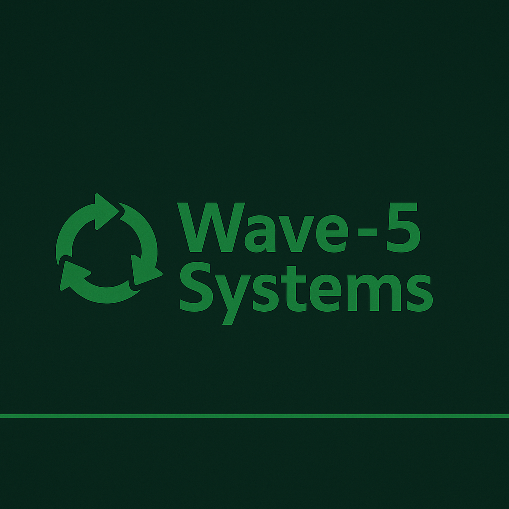
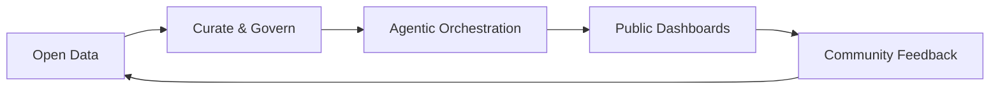

<!-- Drop banner image in /assets/banner-wave5.png -->

  

<h1 align="center">Sajjad Zeraatkar</h1>

<strong>Wave-5 Systems Architect | AI Research | Decision Kits Builder</strong>

  
  
  

  <a href="#overview">Overview</a> •
  <a href="#featured-projects">Projects</a> •
  <a href="#activity--metrics">Activity &amp; Metrics</a> •
  <a href="#tech-stack">Tech Stack</a> •
  <a href="#wave-5-systems--decision-kits">Decision Kits</a> •
  <a href="#lets-connect">Contact</a>

---

## 🔍 Overview {#overview}
- Systems architect blending industrial engineering with AI-native decision tooling.
- Builds Wave-5 agentic stacks tuned for resilience, clarity, and public accountability.
- Leads WESH360 initiatives that turn complex utilities data into actionable dashboards.

## 🚀 Featured Projects {#featured-projects}
<table>
  <tr>
    <td>
      <strong>💠 <a href="https://github.com/wesh360">WESH360 Ecosystem</a></strong> 
      Wave-5 hub for resilient utilities, data pipelines, and community dashboards.
    </td>
    <td>
      <strong>💧 <a href="https://github.com/wesh360/zero-day-of-water">zero-day-of-water</a></strong> 
      Decision kit forecasting water stress and mitigation levers for civic teams.
    </td>
  </tr>
  <tr>
    <td>
      <strong>🧭 <a href="https://github.com/sajjadzea/fa-data-governance-playbook">fa-data-governance-playbook</a></strong> 
      Playbook for transparent data stewardship and request handling in Persian contexts.
    </td>
    <td>
      <strong>🛡️ <a href="https://github.com/sajjadzea/awesome-anti-forgery">awesome-anti-forgery</a></strong> 
      Curated anti-forgery practices to harden data flows and public dashboards.
    </td>
  </tr>
  <tr>
    <td>
      <strong>📊 <a href="https://github.com/sajjadzea/decision-kits">decision-kits</a></strong> 
      Modular AI-assisted kits for rapid decision pilots under uncertainty.
    </td>
    <td>
      <strong>⚙️ <a href="https://github.com/sajjadzea/data_request_governance_service">data_request_governance_service</a></strong> 
      Service blueprint enabling auditable, feedback-rich data request workflows.
    </td>
  </tr>
  <tr>
    <td>
      <strong>🌞 <a href="https://github.com/sajjadzea/solar-plant-dashboard">solar-plant-dashboard</a></strong> 
      Minimal dashboard modeling solar plant performance and investment scenarios.
    </td>
    <td>
      <strong>📈 <a href="https://github.com/sajjadzea/risk-calculators">risk-calculators</a></strong> 
      Lightweight calculators to frame operational and policy risk trade-offs.
    </td>
  </tr>
</table>

## 📈 Activity & Metrics {#activity--metrics}

  
  

  

## 🛠️ Tech Stack {#tech-stack}

  
  
  
  
  
  
  
  
  
  

## 🌊 Wave-5 Systems &amp; Decision Kits {#wave-5-systems--decision-kits}
- Agentic architectures for uncertain environments.
- Decision kits for public dashboards and governance.
- Lightweight tools for emerging-market constraints.

## 🤝 Let’s Connect {#lets-connect}
- Telegram: <a href="https://t.me/AgentNexus">@AgentNexus</a>
- Website: <a href="https://wesh360.ir">wesh360.ir</a>
- Email: <a href="mailto:hello@wesh360.ir">hello@wesh360.ir</a>

Built with ☕ &amp; GPT-powered agentic workflows.

